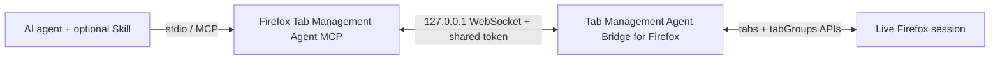

# Agent Bridge for Tab Management in Firefox

[简体中文](README.zh-CN.md)

A local-first toolkit that gives trusted AI agents precise access to tabs and native tab groups in the user's live Firefox session.

This repository distributes three cooperating components:

| Component | Directory | Required | Purpose |
|---|---|---:|---|
| Tab Management Agent Bridge for Firefox | `extension/` | Yes | Calls Firefox's native `tabs` and `tabGroups` APIs |
| Firefox Tab Management Agent MCP | `mcp-server/` | Yes | Exposes a small, authenticated MCP tool surface over stdio |
| Firefox Tab Manager Skill | `skills/firefox-tab-manager/` | Optional | Teaches compatible agents the exact-match and verification workflow |

The MCP server provides the capability. The Agent Skill provides behavior guidance. The browser extension is the only component that talks to Firefox. They are complementary, not alternatives.

## What it can do

- List live tabs and native tab groups with stable IDs.
- Open explicit `http://` and `https://` URLs without stealing focus by default.
- Create an exactly named group from ungrouped tabs in one window.
- Move a precisely selected tab into an existing group.
- Ungroup a precisely selected tab.
- Reject ambiguous matches, duplicate group names, cross-window grouping, and implicit unpinning.
- Read Firefox state again after every write and report success only after verification.

It does not read page bodies, inject content scripts, execute arbitrary page JavaScript, inspect cookies, or send browser data to a project-operated remote service.

## Five-minute setup

Version 0.3.0 includes a Mozilla-reviewed and production-signed XPI in the [GitHub Release](https://github.com/Johnnyzlee/agent-bridge-for-tab-management-in-firefox/releases/tag/v0.3.0). Because that artifact was reviewed before the project rebrand, Firefox displays it as **Local Tab Groups MCP Bridge**. Its signed Gecko ID is permanent; future branded updates will retain the same extension identity.

### 1. Install the signed extension

1. Download `local_tab_groups_mcp_bridge-0.3.0-mozilla-signed.xpi` from the v0.3.0 Release.
2. Open the XPI with Firefox and approve the installation prompt.
3. The Mozilla-signed extension remains installed after Firefox restarts.

### 2. Clone and prepare the MCP server and Skill

```bash
git clone https://github.com/Johnnyzlee/agent-bridge-for-tab-management-in-firefox.git
cd agent-bridge-for-tab-management-in-firefox
npm run quickstart
```

`quickstart` installs the locked dependencies, builds the MCP server and a development copy of the extension, preserves an existing local token when rerun, and generates:

- `.local/bridge-token.txt`
- `.local/mcp-config.json`
- `dist/server/index.js`
- `dist/firefox-extension/manifest.json`

The `.local/` directory is ignored by Git. Treat its token as a local secret.

### 3. Configure the extension

Open **Local Tab Groups MCP Bridge** preferences, keep port `8765`, paste the token from `.local/bridge-token.txt`, and select **Save and reconnect**.

For source development only, you may instead open `about:debugging#/runtime/this-firefox`, select **Load Temporary Add-on**, and choose `dist/firefox-extension/manifest.json`. Firefox removes that temporary build after each restart; do not load it alongside the signed extension on the same port.

### 4. Connect an MCP client

For clients using the common `mcpServers` JSON format, merge the generated `.local/mcp-config.json` into the client's configuration and restart the client.

For Codex, run the generated helper and then restart Codex:

```bash
.local/add-to-codex.sh
```

PowerShell users can run `.local/add-to-codex.ps1`. These ignored local files contain the token, so do not share them. If an MCP entry named `firefox-tabs` already exists, remove or update that old entry before running the helper.

The equivalent generic configuration is:

```json
{
  "mcpServers": {
    "firefox-tabs": {
      "command": "node",
      "args": ["/absolute/path/to/agent-bridge-for-tab-management-in-firefox/dist/server/index.js"],
      "env": {
        "FIREFOX_TABS_BRIDGE_PORT": "8765",
        "FIREFOX_TABS_BRIDGE_TOKEN": "<same-token-as-the-extension>"
      }
    }
  }
}
```

Version 0.3.0 uses one bridge port, so only one stdio MCP client can own the connection at a time. Stop Codex before handing the same port to another client such as Hermes.

### 5. Optionally install the Agent Skill

MCP is sufficient for calling the tools. Install the Skill when the agent host supports `SKILL.md` packages and you want consistent exact matching, guarded failures, and post-operation verification.

For Codex:

```bash
mkdir -p "${CODEX_HOME:-$HOME/.codex}/skills"
cp -R skills/firefox-tab-manager "${CODEX_HOME:-$HOME/.codex}/skills/"
```

Restart the agent after installation. For another agent host, copy `skills/firefox-tab-manager/` into that product's documented skills directory. Skill formats are not standardized across all agents; hosts without `SKILL.md` support should use the MCP server alone.

### 6. Verify the connection

Ask the agent:

```text
Check whether the Firefox bridge is connected, list the current tab groups,
open https://example.com, place the new tab into an exact group named Research,
creating it only if it does not exist, and verify the final group ID.
```

## Architecture



The WebSocket listener binds only to loopback and accepts authenticated connections from a `moz-extension://` origin. See [architecture](docs/architecture.md), [security policy](SECURITY.md), and [privacy policy](PRIVACY.md).

## MCP tools

| Tool | Purpose | Writes browser state |
|---|---|---:|
| `get_firefox_bridge_status` | Report bridge connectivity | No |
| `list_firefox_tabs` | List tab IDs, URLs, titles, windows, and group IDs | No |
| `list_firefox_tab_groups` | List current tab groups | No |
| `open_firefox_tab` | Open an explicit HTTP(S) URL and return its tab ID | Yes |
| `create_firefox_tab_group` | Create and verify a new group | Yes |
| `move_firefox_tab_to_group` | Move one exact tab to one exact existing group | Yes |
| `ungroup_firefox_tab` | Remove one exact tab from its group | Yes |

## Development

Requirements: Firefox 142 or newer, Node.js 20 or newer, and npm.

```bash
npm ci
npm run check
```

The tests cover URL restrictions, exact matching, ambiguous-tab rejection, duplicate groups, cross-window grouping, pinned-tab protection, no-op success, ungrouping, WebSocket origin checks, token authentication, and request timeouts.

Maintainers should follow the [release checklist](docs/release-checklist.md) and [AMO reviewer guide](docs/amo-reviewer-guide.md). Build archives are release artifacts and are intentionally excluded from Git.

## Contributing and license

Read [CONTRIBUTING.md](CONTRIBUTING.md) before opening a pull request. Security reports should follow [SECURITY.md](SECURITY.md), not public issues.

Licensed under the [Mozilla Public License 2.0](LICENSE). “Firefox” is used to identify compatibility with Mozilla Firefox; this project is independent and is not endorsed by Mozilla.
