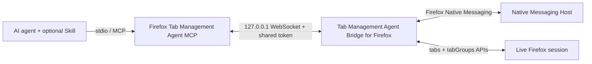

# Agent Bridge for Tab Management in Firefox

[简体中文](README.zh-CN.md)

A local-first toolkit that gives trusted AI agents precise access to tabs and native tab groups in the user's live Firefox session.

This repository distributes four cooperating components:

| Component | Directory | Required | Purpose |
|---|---:|---:|---|
| Tab Management Agent Bridge for Firefox | `extension/` | Yes | Calls Firefox's native `tabs` and `tabGroups` APIs |
| Firefox Tab Management Agent MCP | `mcp-server/` | Yes | Exposes a small, authenticated MCP tool surface over stdio |
| Native Messaging Host | `native-host/` | Yes | Supplies the local bridge configuration to the extension through Firefox Native Messaging |
| Firefox Tab Manager Skill | `skills/firefox-tab-manager/` | Optional | Teaches compatible agents the exact-match and verification workflow |

The MCP server provides the capability. The Agent Skill provides behavior guidance. The browser extension is the only component that talks to Firefox, and the Native Messaging Host is the only component that hands the extension its local bridge configuration. They are complementary, not alternatives.

## What it can do

- List live tabs and native tab groups with stable IDs.
- Open explicit `http://` and `https://` URLs without stealing focus by default.
- Create an exactly named group from ungrouped tabs in one window.
- Move a precisely selected tab into an existing group.
- Ungroup a precisely selected tab.
- Reject ambiguous matches, duplicate group names, cross-window grouping, and implicit unpinning.
- Read Firefox state again after every write and report success only after verification.

It does not read page bodies, inject content scripts, execute arbitrary page JavaScript, inspect cookies, or send browser data to a project-operated remote service.

## Automatic pairing: no manual token

Version 0.4.0 removes the manual token copy-and-paste step. The shared secret still exists and still protects the WebSocket bridge, but it is generated, stored, and delivered automatically:

1. Run `npm run setup` once. It creates the user-level bridge configuration (port, protocol version, and a randomly generated token), registers the Native Messaging Host for Firefox, and writes a token-free generic MCP configuration.
2. The Firefox extension asks the local Native Messaging Host for the bridge configuration through Firefox's own Native Messaging channel. Only an extension whose ID is listed in the host manifest (`firefox-tabs-mcp@local.invalid`) can request it.
3. The extension connects to the MCP server's loopback WebSocket and authenticates with the token it received from the host. The MCP server reads the same token from the same local configuration file.

The token never appears in shell commands, logs, error messages, MCP client configuration, or any Git-tracked file.

## A practical workflow: collect now, read later

Suppose you come across useful articles, documentation, or research links while browsing a feed, chatting, or working on another device. You want to read them carefully later in desktop Firefox, but opening and organizing every page yourself would interrupt the current task and leave the browser full of loose tabs.

Send the URLs to a connected agent such as Hermes instead:

```text
Open these URLs in Firefox in the background. Put every new tab in the exact
group "Reading Queue", creating that group only if it does not exist, and
verify the final tab and group IDs.
```

The agent opens the pages without taking focus and keeps them together in one dedicated group. You can continue what you are doing, then later sit down at the computer and work through the group as a focused reading queue. This turns Firefox tab groups into an inbox for the web: less clutter, less context switching, and less time spent manually organizing tabs.

## Five-minute setup

The current stable, Mozilla-signed release is v0.3.1. Version 0.4.0 (automatic pairing) is in development on the `main` branch and is **not** yet signed or released; keep using the [v0.3.1 signed XPI](https://github.com/Johnnyzlee/agent-bridge-for-tab-management-in-firefox/releases/tag/v0.3.1) until v0.4.0 passes Mozilla review.

### 1. Install the signed extension

1. Download `tab_management_agent_bridge_for_firefox-0.3.1-mozilla-signed.xpi` from the v0.3.1 Release.
2. Open the XPI with Firefox and approve the installation prompt.
3. The Mozilla-signed extension remains installed after Firefox restarts.

For v0.4.0 development builds, load `dist/firefox-extension/manifest.json` from `about:debugging#/runtime/this-firefox` instead. Firefox removes temporary add-ons after each restart.

### 2. Clone, build, and run setup

```bash
git clone https://github.com/Johnnyzlee/agent-bridge-for-tab-management-in-firefox.git
cd agent-bridge-for-tab-management-in-firefox
npm run quickstart
```

`quickstart` installs the locked dependencies, builds the MCP server, the Native Messaging Host, and a development copy of the extension, then runs `setup`, which:

- creates the user-level bridge configuration (or preserves the existing one):
  - macOS: `~/Library/Application Support/Agent Bridge for Tab Management in Firefox/`
  - Linux: `$XDG_CONFIG_HOME/agent-bridge-for-firefox/` (or `~/.config/agent-bridge-for-firefox/`)
  - Windows: `%APPDATA%\Agent Bridge for Tab Management in Firefox\`
- keeps the existing token on reruns and migrates a v0.3.1 `.local/bridge-token.txt` token on first upgrade;
- registers the Native Messaging Host manifest so Firefox can reach it (`allowed_extensions` lists only `firefox-tabs-mcp@local.invalid`);
- writes a token-free generic MCP configuration and Codex helper scripts to `.local/`.

Repeat `npm run setup` at any time to repair a broken registration.

### 3. Start the MCP server

```bash
npm start
```

The server reads the port and token from the user-level configuration. The legacy `FIREFOX_TABS_BRIDGE_TOKEN` and `FIREFOX_TABS_BRIDGE_PORT` environment variables remain supported as explicit overrides for development and v0.3.1 compatibility. If the configuration is missing, the server prints a message that tells you to run `npm run setup`.

### 4. Connect an MCP client

For clients using the common `mcpServers` JSON format, merge the generated `.local/mcp-config.json` into the client's configuration and restart the client. It contains no token:

```json
{
  "mcpServers": {
    "firefox-tabs": {
      "command": "node",
      "args": ["/absolute/path/to/agent-bridge-for-tab-management-in-firefox/dist/server/index.js"]
    }
  }
}
```

For Codex, run the generated helper and then restart Codex:

```bash
.local/add-to-codex.sh
```

PowerShell users can run `.local/add-to-codex.ps1`. These helpers also contain no token. If an MCP entry named `firefox-tabs` already exists, remove or update that old entry before running the helper.

The installed package exposes the same CLI:

```bash
npx firefox-tab-management-agent-mcp setup
npx firefox-tab-management-agent-mcp doctor
npx firefox-tab-management-agent-mcp uninstall        # removes the native host registration, keeps the token
npx firefox-tab-management-agent-mcp uninstall --purge # also deletes the local configuration
```

With no subcommand, the binary starts the MCP stdio server, preserving v0.3.1 client behavior.

### 5. Optionally install the Agent Skill

MCP is sufficient for calling the tools. Install the Skill when the agent host supports `SKILL.md` packages and you want consistent exact matching, guarded failures, and post-operation verification.

For Codex:

```bash
mkdir -p "${CODEX_HOME:-$HOME/.codex}/skills"
cp -R skills/firefox-tab-manager "${CODEX_HOME:-$HOME/.codex}/skills/"
```

Restart the agent after installation. For another agent host, copy `skills/firefox-tab-manager/` into that product's documented skills directory. Skill formats are not standardized across all agents; hosts without `SKILL.md` support should use the MCP server alone.

### 6. Verify the connection

Ask the agent:

```text
Check whether the Firefox bridge is connected, list the current tab groups,
open https://example.com, place the new tab into an exact group named Research,
creating it only if it does not exist, and verify the final group ID.
```

Or open the extension's options page and confirm it shows an automatic configuration status, a connected MCP server state, and the local port. The options page no longer asks for a token.

### Troubleshooting with doctor

```bash
npm run doctor
```

`doctor` checks the configuration directory, the config file and its permissions, the token presence and length (never its value), the Native Messaging manifest and its `allowed_extensions`, the host executable, and whether environment overrides are active. All output hides the token.

If the extension shows “未检测到本地桥接组件” (no local bridge component detected), the host is not registered: run `npm run setup`, then press “修复 / 重新检测本地安装” in the extension options.

## Upgrading from v0.3.1

1. Upgrade the extension in place (same Gecko ID `firefox-tabs-mcp@local.invalid` preserves its settings).
2. Replace the old `.local/` helpers: run `npm run quickstart` (or `npm run setup` after rebuilding). The first setup run migrates the token from `.local/bridge-token.txt` into the new user-level configuration, so a previously configured extension and client keep working.
3. Update your MCP client configuration to the token-free form above. The old token-bearing `env` entries still work through the compatibility override, but the new generated configuration no longer contains them.

## Architecture



The Native Messaging Host runs on the user's machine, never connects to a remote server, and hands the extension only the local bridge configuration (port, protocol version, shared token). The WebSocket listener binds only to loopback and accepts authenticated connections from a `moz-extension://` origin. See [architecture](docs/architecture.md), [security policy](SECURITY.md), and [privacy policy](PRIVACY.md).

## MCP tools

| Tool | Purpose | Writes browser state |
|---|---:|---:|
| `get_firefox_bridge_status` | Report bridge connectivity | No |
| `list_firefox_tabs` | List tab IDs, URLs, titles, windows, and group IDs | No |
| `list_firefox_tab_groups` | List current tab groups | No |
| `open_firefox_tab` | Open an explicit HTTP(S) URL and return its tab ID | Yes |
| `create_firefox_tab_group` | Create and verify a new group | Yes |
| `move_firefox_tab_to_group` | Move one exact tab to one exact existing group | Yes |
| `ungroup_firefox_tab` | Remove one exact tab from its group | Yes |

## Development

Requirements: Firefox 142 or newer, Node.js 20 or newer, and npm.

```bash
npm ci
npm run check
```

The tests cover URL restrictions, exact matching, ambiguous-tab rejection, duplicate groups, cross-window grouping, pinned-tab protection, no-op success, ungrouping, WebSocket origin checks, token authentication, request timeouts, unauthenticated connection rejection, config creation and preservation, legacy token migration, token-free client configuration, environment override behavior, config corruption and version mismatch errors, Native Messaging framing, host message validation, registration authorization, cross-platform path and manifest generation, and token-free CLI output.

Maintainers should follow the [release checklist](docs/release-checklist.md) and [AMO reviewer guide](docs/amo-reviewer-guide.md). Build archives are release artifacts and are intentionally excluded from Git.

## Contributing and license

Read [CONTRIBUTING.md](CONTRIBUTING.md) before opening a pull request. Security reports should follow [SECURITY.md](SECURITY.md), not public issues.

Licensed under the [Mozilla Public License 2.0](LICENSE). “Firefox” is used to identify compatibility with Mozilla Firefox; this project is independent and is not endorsed by Mozilla.
