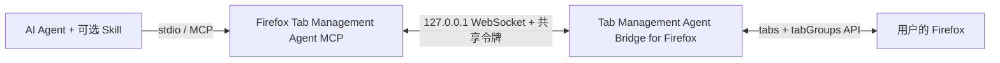

# Agent Bridge for Tab Management in Firefox

[English](README.md)

这是一套本地优先的 Firefox Agent 工具包，让可信任的 AI Agent 能精准操作用户正在使用的 Firefox 标签页与原生标签组。

仓库同时发布三个互相配合的组件：

| 组件 | 目录 | 是否必需 | 作用 |
|---|---|---:|---|
| Tab Management Agent Bridge for Firefox | `extension/` | 是 | 调用 Firefox 原生 `tabs` 与 `tabGroups` API |
| Firefox Tab Management Agent MCP | `mcp-server/` | 是 | 通过 stdio 暴露一组受限、经过认证的 MCP tools |
| Firefox Tab Manager Skill | `skills/firefox-tab-manager/` | 可选 | 教支持 Skill 的 Agent 如何精确匹配、安全失败和操作后验证 |

MCP Server 提供能力，Agent Skill 规定可靠的使用流程，浏览器扩展负责与 Firefox 通信。三者互相补充，不是三选一。

## 能做什么

- 列出实时标签页和 Firefox 原生标签组。
- 打开明确的 `http://` 或 `https://` URL，默认不抢占焦点。
- 用同一窗口内尚未分组的标签页创建标题完全一致的新组。
- 把精确选中的标签页移入已有组，或从组中移出。
- 拒绝歧义匹配、重复组名、跨窗口分组和未经确认的取消置顶。
- 每次写操作后重新读取 Firefox 状态，验证成功后才报告完成。

它不读取网页正文，不注入 content script，不执行任意页面 JavaScript，不读取 Cookie，也不会把浏览器数据发送给本项目运营的远程服务。

## 一个典型场景：先收集，后集中阅读

平时刷信息流、聊天、查资料或使用另一台设备时，你可能不断遇到值得仔细看的文章和网页，希望稍后在电脑上的 Firefox 里集中阅读。如果当场逐个打开和整理，不仅会打断正在做的事，也很容易让浏览器堆满散乱的标签页。

可以把这些 URL 直接发给已经连接本工具的 Agent，例如 Hermes：

```text
请在 Firefox 后台打开这些 URL，把所有新标签页放进标题完全一致的
“待读”标签组；只有该组不存在时才创建，并在最后验证标签页和 group ID。
```

Agent 会在不抢占当前焦点的情况下打开页面，并把它们整理进一个专属标签组。你可以继续手头的事情，等坐到电脑前再集中处理这个阅读队列。这样就把 Firefox 标签组变成了“网页收件箱”：减少页面杂乱、手工整理和频繁切换注意力。

## 5 分钟配置

0.3.0 已通过 Mozilla 审核，正式签名 XPI 位于 [GitHub Release](https://github.com/Johnnyzlee/agent-bridge-for-tab-management-in-firefox/releases/tag/v0.3.0)。由于审核发生在项目改名之前，Firefox 中仍会显示旧名 **Local Tab Groups MCP Bridge**。它的 Gecko ID 已成为永久扩展身份，后续品牌更新仍会沿用同一 ID。

### 1. 安装正式签名扩展

1. 从 v0.3.0 Release 下载 `local_tab_groups_mcp_bridge-0.3.0-mozilla-signed.xpi`。
2. 使用 Firefox 打开 XPI，并确认安装。
3. 这是 Mozilla 签名版本，Firefox 重启后仍会保留。

### 2. 下载并准备 MCP Server 与 Skill

```bash
git clone https://github.com/Johnnyzlee/agent-bridge-for-tab-management-in-firefox.git
cd agent-bridge-for-tab-management-in-firefox
npm run quickstart
```

`quickstart` 会安装锁定版本的依赖、构建 MCP Server 和开发版扩展，并生成：

- `.local/bridge-token.txt`
- `.local/mcp-config.json`
- `dist/server/index.js`
- `dist/firefox-extension/manifest.json`

重复运行时会保留已有令牌，避免 Firefox 与 MCP 配置突然失配。`.local/` 已被 Git 忽略，其中的令牌应视为本地秘密。

### 3. 配置扩展

打开 **Local Tab Groups MCP Bridge** 的“首选项”，保持端口 `8765`，粘贴 `.local/bridge-token.txt` 中的令牌，然后点击“保存并重连”。

只有开发源码时，才需要在 `about:debugging#/runtime/this-firefox` 中“临时载入附加组件”，并选择 `dist/firefox-extension/manifest.json`。临时版会在 Firefox 重启后消失，也不要让临时版和签名版同时占用同一端口。

### 4. 连接 MCP 客户端

使用常见 `mcpServers` JSON 格式的客户端，可以把 `.local/mcp-config.json` 合并到客户端配置中，然后重启客户端。

Codex 用户可以运行生成的辅助脚本，然后重启 Codex：

```bash
.local/add-to-codex.sh
```

PowerShell 用户运行 `.local/add-to-codex.ps1`。这些被 Git 忽略的本地文件包含令牌，不要分享。如果已经存在名为 `firefox-tabs` 的 MCP 配置，请先删除或更新旧配置，再运行辅助脚本。

等价的通用配置如下：

```json
{
  "mcpServers": {
    "firefox-tabs": {
      "command": "node",
      "args": ["/绝对路径/agent-bridge-for-tab-management-in-firefox/dist/server/index.js"],
      "env": {
        "FIREFOX_TABS_BRIDGE_PORT": "8765",
        "FIREFOX_TABS_BRIDGE_TOKEN": "与扩展完全相同的令牌"
      }
    }
  }
}
```

0.3.0 使用一个固定桥接端口，因此同一时间只能有一个 stdio MCP 客户端占用连接。若要从 Codex 切换到 Hermes，应先停止 Codex，再让 Hermes 启动同一 MCP Server。

### 5. 可选安装 Agent Skill

只安装 MCP 就可以调用工具；如果 Agent 支持 `SKILL.md`，再安装 Skill 可以让它稳定遵守精确匹配、错误保护和操作后验证流程。

Codex 安装方式：

```bash
mkdir -p "${CODEX_HOME:-$HOME/.codex}/skills"
cp -R skills/firefox-tab-manager "${CODEX_HOME:-$HOME/.codex}/skills/"
```

完成后重启 Agent。其他 Agent 请把 `skills/firefox-tab-manager/` 复制到该产品文档指定的 Skill 目录。Skill 格式尚未在所有 Agent 之间标准化；不支持 `SKILL.md` 的客户端只使用 MCP 即可。

### 6. 验证

可以对 Agent 说：

```text
检查 Firefox bridge 是否连接，列出当前标签组，打开 https://example.com，
把新标签页加入标题完全一致的 Research 组；只有不存在时才创建，最后验证 group ID。
```

## 架构



WebSocket 只监听 loopback，并要求经过认证的 `moz-extension://` 来源。详情见[架构说明](docs/architecture.md)、[安全政策](SECURITY.md)和[隐私政策](PRIVACY.md)。

## MCP tools

| Tool | 作用 | 是否修改 Firefox |
|---|---|---:|
| `get_firefox_bridge_status` | 查看桥接连接状态 | 否 |
| `list_firefox_tabs` | 列出标签页、URL、标题、窗口与组 ID | 否 |
| `list_firefox_tab_groups` | 列出原生标签组 | 否 |
| `open_firefox_tab` | 打开明确的 HTTP(S) URL | 是 |
| `create_firefox_tab_group` | 创建并验证新组 | 是 |
| `move_firefox_tab_to_group` | 把一个精确标签页移入一个精确已有组 | 是 |
| `ungroup_firefox_tab` | 把精确标签页移出当前组 | 是 |

## 开发与发布

要求 Firefox 142 或更新版本、Node.js 20 或更新版本，以及 npm。

```bash
npm ci
npm run check
```

维护者请遵循[发布清单](docs/release-checklist.md)和 [AMO 审核员指南](docs/amo-reviewer-guide.md)。构建 ZIP 属于 Release 附件，故意不提交到 Git。

提交 PR 前请阅读[贡献指南](CONTRIBUTING.md)。安全问题不要通过公开 issue 披露，请遵循[安全政策](SECURITY.md)。

本项目采用 [Mozilla Public License 2.0](LICENSE)。“Firefox”仅用于说明与 Mozilla Firefox 的兼容性；本项目独立开发，未获 Mozilla 背书。
