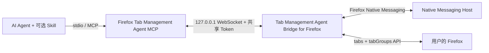

# Agent Bridge for Tab Management in Firefox

[English](README.md)

这是一套本地优先的 Firefox Agent 工具包，让可信任的 AI Agent 能精准操作用户正在使用的 Firefox 标签页与原生标签组。

仓库同时发布四个互相配合的组件：

| 组件 | 目录 | 是否必需 | 作用 |
|---|---:|---:|---|
| Tab Management Agent Bridge for Firefox | `extension/` | 是 | 调用 Firefox 原生 `tabs` 与 `tabGroups` API |
| Firefox Tab Management Agent MCP | `mcp-server/` | 是 | 通过 stdio 暴露一组受限、经过认证的 MCP tools |
| Native Messaging Host | `native-host/` | 是 | 通过 Firefox Native Messaging 向扩展提供本地桥接配置 |
| Firefox Tab Manager Skill | `skills/firefox-tab-manager/` | 可选 | 教支持 Skill 的 Agent 如何精确匹配、安全失败和操作后验证 |

MCP Server 提供能力，Agent Skill 规定可靠的使用流程，浏览器扩展负责与 Firefox 通信，Native Messaging Host 只负责向扩展交付本地桥接配置。四者互相补充，不是四选一。

## 能做什么

- 列出实时标签页和 Firefox 原生标签组。
- 打开明确的 `http://` 或 `https://` URL，默认不抢占焦点。
- 用同一窗口内尚未分组的标签页创建标题完全一致的新组。
- 把精确选中的标签页移入已有组，或从组中移出。
- 拒绝歧义匹配、重复组名、跨窗口分组和未经确认的取消置顶。
- 每次写操作后重新读取 Firefox 状态，验证成功后才报告完成。

它不读取网页正文，不注入 content script，不执行任意页面 JavaScript，不读取 Cookie，也不会把浏览器数据发送给本项目运营的远程服务。

## 自动配对：不再需要手动复制 Token

v0.4.0 取消了手动复制粘贴 Token 的步骤。共享密钥仍然存在，仍然保护 WebSocket 桥接，但生成、存储和交付全部自动完成：

1. 只需运行一次 `npm run setup`。它会创建用户级桥接配置（端口、协议版本、随机生成的 Token）、向 Firefox 注册 Native Messaging Host，并生成不含 Token 的通用 MCP 配置。
2. Firefox 扩展通过 Firefox 自带的 Native Messaging 通道向本地 Host 请求桥接配置。只有 host manifest 中 `allowed_extensions` 列出的扩展 ID（`firefox-tabs-mcp@local.invalid`）才能请求。
3. 扩展用收到的 Token 连接 MCP Server 的 loopback WebSocket 并完成认证；MCP Server 从同一个本地配置文件读取同一个 Token。

Token 永远不会出现在命令行、日志、错误消息、MCP 客户端配置或任何 Git 跟踪文件中。

## 一个典型场景：先收集，后集中阅读

平时刷信息流、聊天、查资料或使用另一台设备时，你可能不断遇到值得仔细看的文章和网页，希望稍后在电脑上的 Firefox 里集中阅读。如果当场逐个打开和整理，不仅会打断正在做的事，也很容易让浏览器堆满散乱的标签页。

可以把这些 URL 直接发给已经连接本工具的 Agent，例如 Hermes：

```text
请在 Firefox 后台打开这些 URL，把所有新标签页放进标题完全一致的
“待读”标签组；只有该组不存在时才创建，并在最后验证标签页和 group ID。
```

Agent 会在不抢占当前焦点的情况下打开页面，并把它们整理进一个专属标签组。你可以继续手头的事情，等坐到电脑前再集中处理这个阅读队列。这样就把 Firefox 标签组变成了“网页收件箱”：减少页面杂乱、手工整理和频繁切换注意力。

## 5 分钟配置

v0.4.0 已发布 AMO 签名 XPI，位于 [GitHub Release](https://github.com/Johnnyzlee/agent-bridge-for-tab-management-in-firefox/releases)。它通过 AMO 的 unlisted（自托管）通道自动签名，尚未通过公开列表（listed）的人工审核；与 v0.3.1 使用同一 Gecko ID，可原地升级并保留设置，同时移除手动 Token 流程。

### 1. 安装正式签名扩展

1. 从 v0.4.0 Release 下载 `tab_management_agent_bridge_for_firefox-0.4.0.xpi`。
2. 使用 Firefox 打开 XPI，并确认安装。
3. 这是 AMO 签名版本，Firefox 重启后仍会保留。

开发版请改用 `about:debugging#/runtime/this-firefox` 临时载入 `dist/firefox-extension/manifest.json`。临时版在 Firefox 重启后会消失。

### 2. 克隆、构建并运行 setup

```bash
git clone https://github.com/Johnnyzlee/agent-bridge-for-tab-management-in-firefox.git
cd agent-bridge-for-tab-management-in-firefox
npm run quickstart
```

`quickstart` 会安装锁定依赖、构建 MCP Server、Native Messaging Host 和开发版扩展，然后运行 `setup`，它负责：

- 创建（或保留）用户级桥接配置：
  - macOS：`~/Library/Application Support/Agent Bridge for Tab Management in Firefox/`
  - Linux：`$XDG_CONFIG_HOME/agent-bridge-for-firefox/`（或 `~/.config/agent-bridge-for-firefox/`）
  - Windows：`%APPDATA%\Agent Bridge for Tab Management in Firefox\`
- 重复运行时保留已有 Token；首次升级时自动迁移 v0.3.1 的 `.local/bridge-token.txt`；
- 注册 Native Messaging Host manifest（`allowed_extensions` 只包含 `firefox-tabs-mcp@local.invalid`）；
- 向 `.local/` 写入不含 Token 的通用 MCP 配置与 Codex 辅助脚本。

任何时候重复运行 `npm run setup` 都可以修复损坏的注册。

### 3. 启动 MCP Server

```bash
npm start
```

Server 从用户级配置读取端口和 Token。旧的环境变量 `FIREFOX_TABS_BRIDGE_TOKEN` 与 `FIREFOX_TABS_BRIDGE_PORT` 仍作为开发/兼容性显式覆盖项支持。若配置缺失，Server 会提示先运行 `npm run setup`。

### 4. 连接 MCP 客户端

使用常见 `mcpServers` JSON 格式的客户端，可以把生成的 `.local/mcp-config.json` 合并到客户端配置中，然后重启客户端。它不含 Token：

```json
{
  "mcpServers": {
    "firefox-tabs": {
      "command": "node",
      "args": ["/绝对路径/agent-bridge-for-tab-management-in-firefox/dist/server/index.js"]
    }
  }
}
```

Codex 用户可以运行生成的辅助脚本，然后重启 Codex：

```bash
.local/add-to-codex.sh
```

PowerShell 用户运行 `.local/add-to-codex.ps1`。这些辅助脚本同样不含 Token。如果已经存在名为 `firefox-tabs` 的 MCP 配置，请先删除或更新旧配置，再运行辅助脚本。

通过 npm 安装的包提供相同 CLI：

```bash
npx firefox-tab-management-agent-mcp setup
npx firefox-tab-management-agent-mcp doctor
npx firefox-tab-management-agent-mcp uninstall        # 移除 Native Host 注册，保留 Token
npx firefox-tab-management-agent-mcp uninstall --purge # 同时删除本地配置
```

不带子命令时启动 MCP stdio Server，保持 v0.3.1 客户端行为不变。

### 5. 可选安装 Agent Skill

只安装 MCP 就可以调用工具；如果 Agent 支持 `SKILL.md`，再安装 Skill 可以让它稳定遵守精确匹配、错误保护和操作后验证流程。

Codex 安装方式：

```bash
mkdir -p "${CODEX_HOME:-$HOME/.codex}/skills"
cp -R skills/firefox-tab-manager "${CODEX_HOME:-$HOME/.codex}/skills/"
```

完成后重启 Agent。其他 Agent 请把 `skills/firefox-tab-manager/` 复制到该产品文档指定的 Skill 目录。Skill 格式尚未在所有 Agent 之间标准化；不支持 `SKILL.md` 的客户端只使用 MCP 即可。

### 6. 验证

可以对 Agent 说：

```text
检查 Firefox bridge 是否连接，列出当前标签组，打开 https://example.com，
把新标签页加入标题完全一致的 Research 组；只有不存在时才创建，最后验证 group ID。
```

也可以打开扩展的“首选项”页面，确认它显示自动配置状态、MCP Server 连接状态和本地端口。选项页不再要求输入 Token。

### 用 doctor 排障

```bash
npm run doctor
```

`doctor` 检查配置目录、配置文件及其权限、Token 存在性与长度（绝不输出值）、Native Messaging manifest 及其 `allowed_extensions`、host 可执行文件，以及环境变量覆盖是否生效。所有输出都隐藏 Token。

如果扩展显示“未检测到本地桥接组件”，说明 host 未注册：先运行 `npm run setup`，再在扩展选项页点击“修复 / 重新检测本地安装”。

## 从 v0.3.1 升级

1. 安装 v0.4.0 XPI 原地升级扩展（同一个 Gecko ID `firefox-tabs-mcp@local.invalid`，保留设置）。
2. 替换旧的 `.local/` 辅助文件：重新运行 `npm run quickstart`（或构建后运行 `npm run setup`）。首次 setup 会把 `.local/bridge-token.txt` 中的 Token 迁移到新的用户级配置，之前配置好的扩展与客户端继续可用。
3. 把 MCP 客户端配置更新为上面的无 Token 形式。旧的带 Token `env` 项仍可通过兼容覆盖继续工作，但新生成的配置不再包含它们；如果 Token 曾明文存在客户端配置中，请一并删除——现在由 `setup` 自动管理。

## 架构



Native Messaging Host 运行在用户本机，不连接任何远程服务器，只向扩展交付本地桥接配置（端口、协议版本、共享 Token）。WebSocket 只监听 loopback，并要求经过认证的 `moz-extension://` 来源。详情见[架构说明](docs/architecture.md)、[安全政策](SECURITY.md)和[隐私政策](PRIVACY.md)。

## MCP tools

| Tool | 作用 | 是否修改 Firefox |
|---|---:|---:|
| `get_firefox_bridge_status` | 查看桥接连接状态 | 否 |
| `list_firefox_tabs` | 列出标签页、URL、标题、窗口与组 ID | 否 |
| `list_firefox_tab_groups` | 列出原生标签组 | 否 |
| `open_firefox_tab` | 打开明确的 HTTP(S) URL | 是 |
| `create_firefox_tab_group` | 创建并验证新组 | 是 |
| `move_firefox_tab_to_group` | 把一个精确标签页移入一个精确已有组 | 是 |
| `ungroup_firefox_tab` | 把精确标签页移出当前组 | 是 |

## 开发与发布

要求 Firefox 142 或更新版本、Node.js 20 或更新版本，以及 npm。

```bash
npm ci
npm run check
```

测试覆盖：URL 限制、精确匹配、歧义标签页拒绝、重复组、跨窗口分组、置顶保护、无操作成功、取消分组、WebSocket 来源检查、Token 认证、请求超时、未认证连接拒绝、配置创建与保留、旧 Token 迁移、无 Token 客户端配置、环境变量覆盖、配置损坏与版本不匹配错误、Native Messaging framing、host 消息校验、注册授权、跨平台路径与 manifest 生成、以及无 Token 的 CLI 输出。

维护者请遵循[发布清单](docs/release-checklist.md)和 [AMO 审核员指南](docs/amo-reviewer-guide.md)。构建 ZIP 属于 Release 附件，故意不提交到 Git。

提交 PR 前请阅读[贡献指南](CONTRIBUTING.md)。安全问题不要通过公开 issue 披露，请遵循[安全政策](SECURITY.md)。

本项目采用 [Mozilla Public License 2.0](LICENSE)。“Firefox”仅用于说明与 Mozilla Firefox 的兼容性；本项目独立开发，未获 Mozilla 背书。
