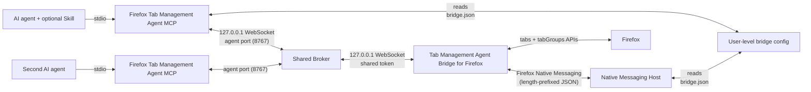

# Architecture and Trust Boundaries

## Components

1. An AI agent, optionally guided by the Firefox Tab Manager Skill, starts Firefox Tab Management Agent MCP as a local stdio server.
2. The MCP server reads the user-level bridge configuration (port, protocol version, token) and either becomes the shared broker (first instance) or connects to the running broker as an authenticated client. `FIREFOX_TABS_BRIDGE_TOKEN`, `FIREFOX_TABS_BRIDGE_PORT`, and `FIREFOX_TABS_BRIDGE_BROKER_PORT` remain supported as explicit development/compatibility overrides.
3. Tab Management Agent Bridge for Firefox requests its bridge configuration from the Native Messaging Host through Firefox's Native Messaging channel. Firefox only launches the host for extensions listed in the host manifest's `allowed_extensions`; the host additionally refuses to serve the configuration when its own registration does not authorize exactly `firefox-tabs-mcp@local.invalid` or the calling extension's ID does not match.
4. The extension caches the received configuration in `browser.storage.local` (falling back to it when the host is temporarily unavailable), connects to the configured port, and authenticates with the shared token.
5. The extension performs a small fixed set of operations through Firefox's `tabs` and `tabGroups` APIs.
6. Write operations read the resulting browser state before reporting success.

## User-level bridge configuration

A single shared module (`shared/config.ts`) owns all configuration path logic. The directory depends on the platform:

- macOS: `~/Library/Application Support/Agent Bridge for Tab Management in Firefox/`
- Linux: `$XDG_CONFIG_HOME/agent-bridge-for-firefox/` or `~/.config/agent-bridge-for-firefox/`
- Windows: `%APPDATA%\Agent Bridge for Tab Management in Firefox\`

`bridge.json` stores the protocol version, the WebSocket port, and the token. It is written atomically with mode `0600` on macOS/Linux. `FIREFOX_TABS_BRIDGE_CONFIG_DIR` overrides the root for development and tests.

The extension does not read this file directly; it receives the same values from the Native Messaging Host, which keeps the browser and the MCP server in sync without user involvement.

## Native Messaging Host

The host (`native-host/`) is a minimal length-prefixed JSON message loop. Firefox specifies the 4-byte length prefix in native byte order; all supported platforms are little-endian. Messages are capped at 1 MiB. The host accepts `ping`/`get_status` and `get_bridge_config`, validates the message type and protocol version, and replies with typed `status`, `bridge_config`, or `error` messages. `get_bridge_config` is served only when the host's own registered manifest authorizes exactly the expected extension ID, and the calling extension's ID (which Firefox passes as a command-line argument since Firefox 55) matches the expected ID. Error messages never include the token.

The manifest `path` points to a small launcher script that `setup` generates with absolute paths: `native-host/firefox_tabs_agent_bridge.sh` on macOS/Linux (executes the absolute Node.js binary and the bundled host) and `native-host/firefox_tabs_agent_bridge.cmd` on Windows. This is required because Firefox spawns native apps with a restricted environment on macOS, where a `#!/usr/bin/env node` host would not find Node.js on `PATH`.

The host manifest is registered per platform: `~/Library/Application Support/Mozilla/NativeMessagingHosts/` on macOS, `~/.mozilla/native-messaging-hosts/` on Linux, and the user-level `HKCU\Software\Mozilla\NativeMessagingHosts` registry key on Windows. The Windows path logic is implemented and unit-tested but has not been exercised on a real Windows machine.

## Protocol

The first extension frame over the WebSocket is an authentication message. Later frames are typed request/response messages with request identifiers. Requests have a timeout, and malformed, unauthenticated, or unsupported messages are rejected. Connections that never authenticate are closed.

The MCP surface intentionally contains only these operations: bridge status, list tabs, list groups, open an HTTP(S) tab, create a group, move a tab to a group, and ungroup a tab.

## Write safety

Selectors use a tab ID, exact URL, or exact title. Ambiguous matches are returned as errors instead of being guessed. Group names are exact within one window. Grouping across windows is rejected. Pinned tabs require explicit opt-in because Firefox may unpin them during grouping. Every successful write is followed by a state read and invariant check.

## Data boundary

Open-tab metadata crosses from Firefox into the local MCP process and then to the invoking MCP client. It is not sent to a project-operated service. See [the privacy policy](../PRIVACY.md) for the complete disclosure.

## Shared broker and multiple agents

Since 0.5.0, a shared broker multiplexes any number of MCP agents over the single Firefox connection. The broker listens on two loopback ports: the extension port (`8765`) for the Firefox extension, and the agent port (`8767`, override with `FIREFOX_TABS_BRIDGE_BROKER_PORT`) for MCP server instances. The first server instance to start becomes the broker; later instances detect the occupied ports and connect to the broker as authenticated clients, routing requests through it to the extension. The extension itself is unchanged and still holds one WebSocket connection. Every agent authenticates with the same shared token from the user-level configuration, so no per-client secrets exist.

## Current limitations

The broker keeps all traffic on loopback and authenticates every connection (extension origin check plus timing-safe token comparison, agent token comparison). Agent connections are not individually scoped: any client that holds the shared token can request the exposed operations, exactly as in previous versions. A future version could issue per-client credentials or scope tools per agent. The bridge is not intended to be exposed through port forwarding, containers with public port mappings, or non-loopback proxies.
