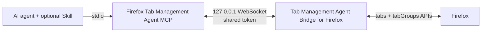

# Architecture and Trust Boundaries

## Components

1. An AI agent, optionally guided by the Firefox Tab Manager Skill, starts Firefox Tab Management Agent MCP as a local stdio server.
2. The MCP server opens an authenticated WebSocket listener on `127.0.0.1`.
3. Tab Management Agent Bridge for Firefox connects to the configured port and authenticates with the shared token.
4. The extension performs a small fixed set of operations through Firefox's `tabs` and `tabGroups` APIs.
5. Write operations read the resulting browser state before reporting success.

## Protocol

The first extension frame is an authentication message. Later frames are typed request/response messages with request identifiers. Requests have a timeout, and malformed, unauthenticated, or unsupported messages are rejected.

The MCP surface intentionally contains only these operations: bridge status, list tabs, list groups, open an HTTP(S) tab, create a group, move a tab to a group, and ungroup a tab.

## Write safety

Selectors use a tab ID, exact URL, or exact title. Ambiguous matches are returned as errors instead of being guessed. Group names are exact within one window. Grouping across windows is rejected. Pinned tabs require explicit opt-in because Firefox may unpin them during grouping. Every successful write is followed by a state read and invariant check.

## Data boundary

Open-tab metadata crosses from Firefox into the local MCP process and then to the invoking MCP client. It is not sent to a project-operated service. See [the privacy policy](../PRIVACY.md) for the complete disclosure.

## Current limitation

Version 0.3.0 uses a server-per-client architecture and one configurable bridge port. Only one MCP client can own that port at a time. A future shared daemon could multiplex multiple authenticated MCP clients while keeping the Firefox connection local.
